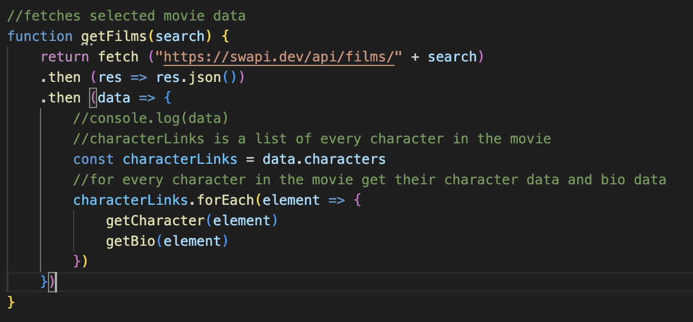
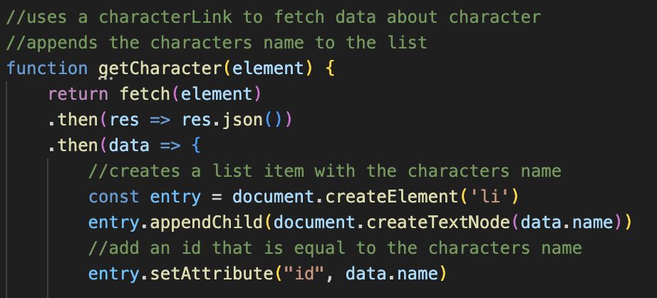
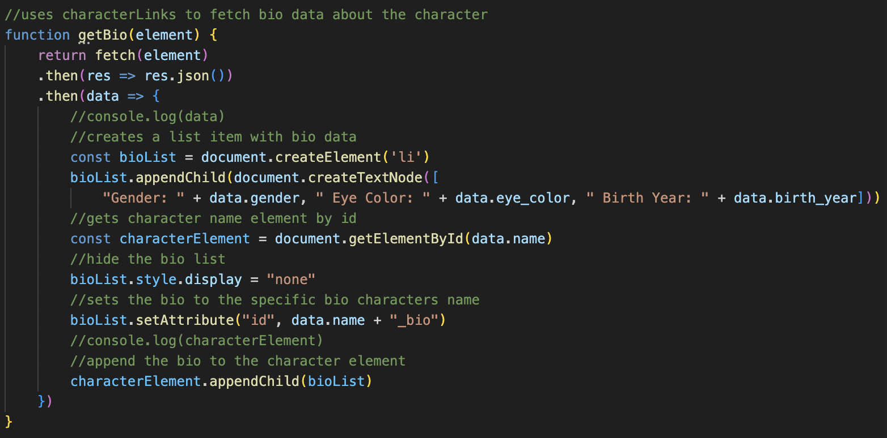
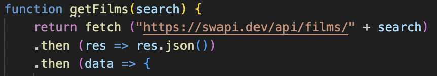
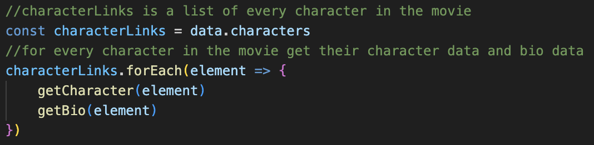

Star Wars Character Finder

User Description 
This application allows the user to search through six star wars films in order to pull character names from that movie and display them in a list.
Each individual name is able to be clicked on in order to display each individual character data featuring their gender, eye color and birth year.

Design Description
This application has a simplistic design featuring a galaxy background image (pc: Bryan Goff) with a title and a basic form.

The form features a dropdown menu where the user can select from six Star Wars films and click the “submit” button to find character names and display them in a list.

All text in the body is white in order to contrast against the background except when the list text is hovered over in which it displays blue (displayed through javascript).

Functionality Description
This application uses javascript for all functions of the page. This application features event listeners that run functions when the submit button is clicked, when the character names are hovered over to turn them blue and back to white and to run a function when the character name is clicked to display the character bio information.

This application also features three different functions; getFilms, getCharacter and getBio.

getFilms fetches data from an api then returns the “characters” data. It then calls on the other two functions for each character (element) in the movie to get their character data and their bio data.

getCharacter uses (element) to fetch the data about the character and then appends the characters name to a list item with the characters name. This function also uses two event listeners to change the style color to blue with a (mouseover) event and changes the style color to white with a (mouseout) event. A third event listener is added in this function that unhides the bio information when a name is clicked.

getBio uses (element) to fetch the data about the characters bio information (gender, eye color and birth year) and then creates a list item with the bio data to then append it to the character element. This function also hides the bio list initially and sets the bio data to a specific bio character’s name. 

___________________________________________________________________________________

Fetching API data - BLOG

Fetching API data was one of the more complicated concepts to understand when learning JavaScript and something I had to use a lot when working on my project. What was more interesting to learn was that it is possible to fetch another API URL within another API URL. 

The inner workings of my project that makes it function the way that it does is all due to this one concept. The API URL that I had been using supplied its data content through URL links within one massive API. Figuring out how this worked was a task but one that I am lucky to have figured out how to do. This will be a great skill to have when working with other APIs in future projects.

Before getting to explaining how this all works let me first go over exactly what a fetch and API is and how to use them.

FETCH

A fetch is a function that retrieves data through an API URL (more on what this is later). This function calls on fetch() and passes a URL, or path to a resource, as the argument. The function then retrieves the data from that resource and returns it back to the server. You can do this by using a .then().

The data that is returned is not something that you can just use though. You will have to add .json() to the end of your response in order to take the data and format it into a string that you can then use in your code.

After you have returned your response you are then able to do another .then() in order to use the data that you fetched in any function that you would like.

For example in my project I decided to fetch the film data from my API and use it to get the characters name and some of their bio information.

API

So now that we know how to use a fetch(), what exactly is the API that we are using to fetch data?

API, meaning “Application Programming Interface”, is a way people are able to expose their data to the application that we are building. In a way it is kind of like a bridge allowing us to use outside source data for our own applications.

Every API is different and supplies different amounts of information so it is a good idea to do your research before getting too far into your project and realizing the API you are using does not have what you need.

Example being myself and not realizing the API I was using was full of other API links making my project all that more complex.

FETCHING AN API FROM AN API

Now that we understand what API and fetch is we can now get into how to fetch a separate API from the main API.

To start off you will want to grab the data that you will be using from the original API by using a fetch() and .then() as explained above. In my example I wanted to pull all the data from each individual movie film.

Then with the data you just pulled you will want to write a function that uses other API links that you can use to fetch. 

In my project I wanted to pull the characters name and their bio information. In this example let’s just focus on the character name. I had to create a variable called “characterLinks” that would pull all the individual character's API links. Using .forEach() I was able to write a function for what I wanted to do for each element. In this case, pull the character's name.

Now your function is set up to fetch data from your original API you can then fetch that data again and use it to write any function that you want.

In my project I wanted to fetch all of the character names for each character API link. To do this I wrote a function that fetched the elements of “characterLinks”, returned the response in JSON format and then used that data to create a list and append the names to that list.
 

For getting the bio information I was able to use the same process with using the .forEach element created in the original fetch.

Though this was a tedious task to do, it was full of great lessons. One being I now know how to pull APIs from anywhere and two, always research the APIs you are using.

